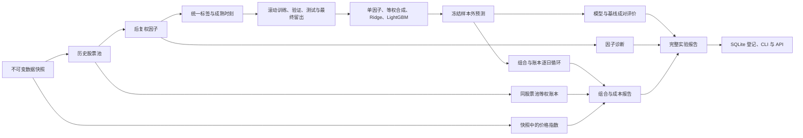

# 后端研究框架逻辑

2026-10-01。沿用 V2.0 的时间、价格、股票池、账本和复现契约；本轮实现研究与实验后端，前端按当前要求暂缓。
领域名词以 `CONTEXT.md` 为准。推荐配置为 `configs/research/daily_four_models_v1.yaml`。

## 从数据到实验



`observe research` 保留单独生成预测的入口；`observe run` 保留原来的离线账本回放入口；新增 `observe experiment` 将二者串成完整实验。
研究核心不导入 FastAPI。CLI、队列和 API 均调用同一组核心函数，查询接口只读落盘产物。

| 阶段 | 输入与规则 | 输出 / 入口 |
| --- | --- | --- |
| 数据 | 必须指定已存在的快照；只读标准分区；本轮不下载或重新发布数据 | `Store.state`、研究的 `data_manifest.json` |
| 股票池 | 历史在市证券，按决策日的上市、ST、停牌与流动性规则过滤；不提前按未来标签筛选 | `universe.parquet` |
| 因子 | 后复权价；时序窗口按交易日；横截面只用当天候选；方向先验固定 | 冻结的 `factor_set.yaml`、`factors.parquet` |
| 标签 | k+1 开盘进入、k+1+h 开盘退出；端点停牌不顺延；成熟时点记录到表 | `labels.parquet` |
| 切分 | 训练、验证、测试按决策日滚动；选参和重拟合分别按成熟时刻过滤；最终留出不足时阻断 | `split_plan.parquet` |
| 模型 | 每个决策日总训练权重相同；相关因子只在训练窗去重；所有候选结果保存 | 每窗模型 JSON、选参记录、`predictions.parquet` |
| 组合与账本 | 收盘决策，下一交易日开盘先卖后买；原始价、T+1、整手、费用和公司行动全部走现有唯一账本 | `variants/<id>/` 中的订单、成交、持仓、现金事件和净值 |
| 评价 | 标签只在开发区间内成熟；评价不训练、不成交；不可定义值保留缺失 | 三层 `report.json`、每日因子诊断与分组表 |

## 四个模型的选择与拟合

原有 `ModelConfig` 默认继续生成三个模型。显式配置非空的 `models.lgbm` 网格启用第四个模型；网格最多 12 组，不会因缺少依赖而静默跳过 LightGBM。

每个窗口依次执行：

1. 在训练窗做因子相关性去重，保留单因子基线所需的原始特征。
2. 用 `matured_at <= select_asof` 的训练样本拟合全部候选。Ridge 保持原 alpha / normalized 两种口径。
3. LightGBM 构建独立验证 Dataset，用 `matured_at <= fit_asof` 的验证样本按每日等权的 L2 早停；验证窗平均秩 IC 选择参数组合。L2 早停和秩 IC 选参是两个明确记录的步骤。
4. 每个模型族的验证秩 IC 全部不可定义时阻断，不能默认取第一个候选。
5. 在训练加验证的已成熟样本上重拟合。LightGBM 使用验证阶段冻结的迭代次数，重拟合不再早停；最终留出与测试窗标签均不参与此过程。
6. 在测试窗全部候选上预测，包括标签无效的证券。特征名与顺序不一致、非有限分数、重复预测或不匹配的测试窗都拒绝进入账本。

LightGBM 固定 CPU、随机种子、线程数、`deterministic=true` 和 `force_col_wise=true`。每窗保存原生 Booster 文本、特征顺序、版本、拟合样本数、选定迭代次数和增益重要性，不使用 pickle。
保存加载的预测在相同环境下逐位一致；不同平台的复现使用显式数值容差，并报告代码与依赖漂移，不能承诺不同二进制在任何数据上逐位相同。

## 三层评价

因子层保留原来的评价文件，并增加 `factor_daily.parquet`、`factor_groups.parquet` 与 `factor_diagnostics.json`：皮尔逊 IC、秩 IC、五组标签均值、多空标签差、分组换手、相邻决策日排名自相关、每日等权覆盖率、分年结果、因子相似度与块抽样区间。
分组名单先用当天有限因子值确定，并列值不随机拆开；标签缺失不替补、不补零。不同日期的排名自相关先在各自完整候选上排名，再对共同证券计算相关。分组收益是复权标签诊断，不连乘成净值。

模型层通过现有 `evaluation.paired` 比较 Ridge / LightGBM 与两个基线。预测主键、测试窗、模拟拟合时点、证据级别先通过成对门槛，再计算逐日秩 IC、前 N 名标签和逐窗差值。
按交易日位置做连续日期块抽样，块长为 `max(20, 4h)`，另报告两倍块长的敏感性区间；不可定义日保留原位置。区间描述固定预测条件下的抽样不确定性，不包含重新选参和拟合的变化。

组合层每个模型分别运行 `base`、`fees_x2`、`slippage_x2`，共 12 个账本运行。费率和滑点变化后重新生成逐日订单，复用同一份预测，不能把固定订单重放当作正式成本情景。
账本阻断的组合不展示正式绩效。基础滑点为 0 时，加倍仍为 0 的限制会记录；加倍后的滑点越界在配置阶段拒绝。

默认开启两个基准（`benchmarks.enabled: true`）：沪深 300 价格指数 `000300.SH`（不含分红），以及同股票池、同调仓节奏、同执行条件的完整候选等权组合。指数只从指定快照读取，不从当前发布状态或快照之外的文件补齐。
指数以前一交易日收盘作为期初；缺少某日收盘时，该日与下一交易日的指数日收益都不可定义，不前向填充或跨缺口计算。策略日收益仍完整保留。主动日收益为策略减基准；信息比率使用共同有效日的主动收益；年化收益率差在共同有效日分别复利年化后相减，年化系数仍为 242。

等权组合每个成本情景各运行一次，共三个额外账本子实验，产物位于 `benchmarks/`。它只使用冻结的 `universe.parquet` 与测试区间，不看模型分数、因子或未来标签是否缺失；调仓时重设全体候选的等权目标，沿用最大权重、参与度、现金规则、滑点、费用、T+1 与公司行动。
不使用 Top-N 的 `n`、`buffer`、`max_sell`。已有持仓超过目标时按决策收盘价生成整手部分减持，保留其余股份；非调仓日仅重发尚未完成的调仓意图。整手、现金与成交限制会使实际权重偏离目标。

新增 `benchmark_eval.json` 与 `benchmark_daily.parquet`，按模型、成本情景、基准分别保存主动指标、相对净值、共同日期与缺失日期。任一策略账本被阻断就不进入基准比较；等权账本被阻断时，其完整比较同样不可用，策略自身的可信指标仍保留。
旧快照 `20260930-121952-b7e8` 缺 `index_1d`，对应历史实验的指数主动指标仍不可用；2026-10-02 新快照 `20261002-213302-275d` 已补入真实沪深 300 日线并完成主动指标与复现验证，详见文末记录。真实同股票池等权基准已接通。

## 实验与预测复用

完整实验目录包含冻结配置、规则、一个研究子实验、模型与成本情景的账本子实验、三层报告、限制和内容哈希。
`subruns.json` 保存每个子实验的编号、路径、状态与 manifest 哈希；`data/runs/registry.sqlite` 保存实验状态、快照、代码提交、证据级别、父实验编号和路径。
旧实验通过 `observe runs index` 登记；网页服务启动时也读取旧状态建立登记。索引不改实验文件。

`observe variant` 只接受模型、组合、执行、初始资金与评价日期的设置；快照、因子、标签和切分继承父实验，禁止更换。
局部组合配置覆盖父实验对应字段，其余保持父配置；产物在父实验 `variants/` 下独占创建，已有文件不覆盖，也不会调用模型 fit。
除了父实验的预测复用，跨完整实验的阶段缓存已实现：股票池、逐个因子、分钟分区聚合、标签、切分、拟合与预测、详细评价和逐日账本。缓存放在 `data/cache/stages/<阶段>/<键>/`，每次实验保存独立的 `cache.json`；完整实验父目录记录详细评价缓存，研究与账本子目录记录各自阶段。

缓存键由快照身份、实际输入文件哈希、该阶段配置、上游产物内容、相关代码内容与 Python / 依赖版本组成；不以 Git 提交号变化代替相关代码变化。
修改单个公式、且不改变预热与候选边界时，只计算该因子；其他因子、标签与切分可复用。修改标签持有期重新生成标签及依赖阶段；修改成本复用研究和详细因子 / 模型评价，重算受影响的账本；同配置重复执行可复用账本。快照身份变化则全部重算。
每个键通过文件锁独占生成，临时目录完成后才发布；命中前逐文件校验哈希，损坏条目保留到 `data/cache/quarantine/` 后重算。复制产物到新实验，不使用硬链接，不覆盖已有产物。程序异常保留临时产物但不发布；账本阻断结果可作为诊断缓存，不能作为正式绩效。
读取输入和执行审计仍逐次运行，缓存不代替数据完整性检查；当前没有自动清理或缓存淘汰。

`observe reproduce` 强制绕过全部缓存，在新目录重跑研究、每个账本情景和基准，逐值比较股票池、因子、标签、切分、预测、因子每日明细、分组、评价、订单、账本与主动指标。复现前还核对冻结指数输入的文件哈希。
JSON 字典与列表中的浮点数递归使用 `abs_tol` / `rel_tol`；字符串、布尔值、键和列表结构保持严格比较。
旧 Windows 预测路径可按原实验编号在当前数据根目录或登记表定位，随后仍校验快照和冻结文件哈希，不下载替代数据。

## 使用命令

```bash
# 重建环境；Mac 缺少 libomp 时按环境规范用 Homebrew 安装
uv sync --extra ml --dev

# 完整实验，也可添加 --queue 提交后台任务
uv run --extra ml observe --root data experiment --config configs/research/daily_four_models_v1.yaml --snapshot 20261002-213302-275d

# 普通实验也可强制重算（YAML / 队列对应 cache: false）
uv run --extra ml observe --root data experiment --config configs/research/daily_four_models_v1.yaml --snapshot 20261002-213302-275d --no-cache

# 仅重跑组合：YAML 中写 model、portfolio 或 execution
uv run --extra ml observe --root data variant <实验编号> --config <组合变体.yaml>

# 只读既有因子与标签，不重新训练
uv run --extra ml observe --root data factor eval --run <研究或完整实验编号>
uv run --extra ml observe --root data factor validate 'ts_mean(close_adj, 20)'

uv run --extra ml observe --root data runs list --kind experiment
uv run --extra ml observe --root data runs show <实验编号>
uv run --extra ml observe --root data compare <实验编号A> <实验编号B>
uv run --extra ml observe --root data reproduce <实验编号>
```

API 包括 `/api/factors`、`/api/factors/validate`、`/api/factors/{name}/evaluation?run=`、`/api/runs`、`/api/runs/compare?ids=a,b` 和实验详情。
`/api/runs/{id}/{table}` 对预测、因子、标签、订单、成交、持仓与净值使用 DuckDB 分页，支持日期、证券、模型和成本情景筛选。
`benchmark_daily` 另支持 `benchmark=000300.SH` 或 `benchmark=universe_equal`；查询等权基准账本用 `model=universe_equal&scenario=base`。实验详情直接返回缓存与基准评价报告。
新任务类型为 `experiment`、`backtest_variant`、`factor_eval`，配置在排队前校验，CLI 与任务返回同一套状态。

## 验证与边界

合成数据覆盖四模型预测、测试标签隔离、保存加载、完整离线复现、预测复用、成本情景、异常预测拒绝、因子手算、并列值、每日覆盖率、CLI / API / 队列和父实验文件保护。
原有三个模型与原配置保持兼容；原先迁移校验中的嵌套系数范数误报已修复。

执行 `uv run --frozen --extra ml pytest -q`，全量 277 项通过；最后补齐空成交 / 持仓表筛选和预测的模型筛选后，复测 `tests/integration/test_experiments.py`，10 项全部通过。
`ruff check src tests` 与 `git diff --check` 均通过。测试仅有现有 Starlette TestClient 对 httpx 的弃用提示，未额外安装新的 HTTP 客户端。

继续开发后的全量测试为 **288 项通过**。新增验证包括：指数缺口与期初缺失、完整候选等权及整手减持的独立手算、T+1 与参与度、并发缓存仅生成一次、损坏缓存隔离、失败不发布、改单因子 / 标签 / 快照 / 成本的失效范围、账本复用、基准 API 筛选、复现全部绕过缓存。原有回放黄金样本与复现契约均通过。

真实数据验证使用现有 `20260930-121952-b7e8` 快照、2024 年成交额较高的主板证券、预先固定的短窗口配置，验证四模型与 12 个账本情景的工程流程。
它使用较短训练窗和收窄股票池，不替代推荐配置的全区间研究，也不支持策略有效性结论。
当前日线从 2021 年开始，分钟线截至 2026-09-04；快照仍有 332 条日线审计警告，分钟缺退市证券，均继续保留在实验限制中。

本轮实际产物：

- 完整真实验证：`data/runs/20261001-210946-ed3583-experiment-15a8/`，四个测试窗、四模型、12 个账本情景，均为 `success_limited`（保留数据审计限制）。
- 完整真实验证复现：`data/runs/20261001-211036-ed3583-experiment-9c94/`，`comparison.json` 为 `match`，差异 0，包括因子每日明细 / 分组、预测和全部账本情景。
- 历史分钟研究复现：`data/runs/20261001-204931-2a8da7-repro-cfb5/`，源实验 `20260930-172026-59fb44-pair-extended-891b`，原先嵌套系数范数误报消除，差异 0。

本次基准与缓存的真实验证沿用上述预先固定的 2024 年工程配置，使用相同快照，没有下载或发布新数据：

- 首次运行：`20261001-230217-f274a8-experiment-d7a0`，13 个研究缓存条目首次生成，12 个模型 / 成本账本与 3 个等权基准账本均为 `success_limited`。
- 只改滑点至 0.0015：`20261001-230313-2258e2-experiment-2280`，13 个研究条目全部命中，15 个账本全部重算。
- 同配置再次运行：`20261001-230401-2258e2-experiment-ea79`，13 个研究条目和 15 个账本全部命中，详细评价也命中。
- 强制重算复现：`20261001-230446-2258e2-experiment-91f4`，`comparison.json` 为 `match`，差异 0，包括三个等权基准账本与全部逐日主动指标。
- 历史完整实验兼容复现：`20261001-231219-efd7e9-experiment-dbf9`，源实验 `20261001-210946-ed3583-experiment-15a8`，差异 0。旧配置未声明基准时沿用原设计，不在复现中擅自增加基准。
- 汇总记录：`data/validations/20261001-230217-f274a8-experiment-d7a0-benchmark-cache.json`。已发布状态哈希保持不变，历史完整实验 manifest 再次校验通过。真实快照没有价格指数，所以这些运行没有有效的指数主动指标；等权主动比较可用，仍受原数据审计限制。

## 指数入库与真实基准闭环（2026-10-02）

新增独立的 `data.indices` 服务：固定已发布日历和证券主数据 → 确认指数代码 → BaoStock 原始日线留底 → 标准化 → 全交易日覆盖与主键 / 价格审计 → 合并 `index_1d/all` → 原子发布 → 重新审计日线 → 冻结新快照。研究本身继续只读快照，不联网。CLI、队列和 API 共用核心函数，参考代码与环境安装记录分别见文档 04、03。

```bash
uv sync --extra ml --extra data --dev
# 本机日历缺少 2021-01-09、10；按两个日历完整的区间取数，不猜测缺失日历
uv run --frozen --extra ml --extra data observe --root data data index --start 2021-01-04 --end 2021-01-08
uv run --frozen --extra ml --extra data observe --root data data index --start 2021-01-11 --end 2026-09-29
# index 支持 --queue；多指数用 --indices 000300.SH,000905.SH
uv run --frozen --extra ml --extra data observe --root data data audit
uv run --frozen --extra ml --extra data observe --root data data snapshot --note '包含已审计价格指数'
uv run --frozen --extra ml --extra data observe --root data data index-bars --snapshot 20261002-213302-275d --index 000300.SH --start 2024-01-01 --end 2024-12-31 --limit 10
```

接口：`POST /api/jobs` 的 `kind=data_index`、`params={start,end,indices}`；只读接口 `GET /api/indices/000300.SH/bars?snapshot=<id>&start=<日期>&end=<日期>&limit=1000&offset=0`。失败响应留审计记录，整批不发布，任务为 `failed`；重复且内容相同不产生新批次。没有自动修补缺失日历或缩短请求区间。

真实验证结果：

- 指数覆盖：沪深 300 **1,392 行**，2021-01-04 至 2026-09-29；两个入库审计均为零问题。重复更新返回 `unchanged`，已发布文件哈希不变。
- 发布批次 `20261002-213038-780e`、新快照 `20261002-213302-275d`；日历、股票行情、证券资料、复权、公司行动和分钟数据分区均保持原引用。旧快照及旧工程实验全部文件哈希核验未变。
- 日线重新审计 `20261002-213302-2266`：6,848,484 行、1,392 个交易日，原有 **332 条警告**仍保留（306 条 beyond_limit、26 条 vwap_outside），没有因加入指数而消失。
- 完整实验 `20261002-213302-dc7654-experiment-0f0c`：沿用预先固定的 2024 年高成交额股票池与短窗口参数，四模型、12 个成本账本、3 个等权基准账本完成；12 组沪深 300 比较全部可用、缺失收益日为 0。
- 强制离线复现 `20261002-213405-dc7654-experiment-2504`：`match`、差异 **0**，包含价格指数输入指纹及逐日主动指标；两次实验均为 `success_limited`，保留原有日线审计限制。
- 汇总报告：`data/validations/20261002-213509-index-pipeline.json`。
- 真实 API 验证：2024 年指数查询共 242 日，LightGBM / fees_x2 的指数主动收益明细共 84 日；旧快照仍返回 0 行指数。记录在 `data/validations/20261002-index-api.json`。

测试新增覆盖数据缺日、空响应、断网、会话失败、错误代码、重复主键、非法价格与量额、未知日历标记、部分指数失败时整批拒绝、写入异常、锁竞争、幂等、其他日期 / 指数保护、旧快照保护和 CLI / API 参数一致。完整实验的测试夹具现在经公开指数入库服务生成快照，再验证四模型和离线复现。

最终执行 `uv run --frozen --extra ml --extra data pytest -q`：**310 项通过**（143.31 秒）；`ruff check src tests`、`git diff --check` 均通过。仅保留原有 Starlette / httpx 弃用提示，没有为消除提示安装其他客户端。

这轮完成工程闭环，不据此判断策略有效。指数尚未做独立上游的交叉核对；2007 年起的日线研究数据仍缺，当前分钟线仍缺退市证券；前端继续暂缓。

## 只读预检与存储指纹（2026-10-02）

新增需求中的 `observe doctor`，适用于启动长研究任务前检查环境、完整实验配置及固定快照。默认检查元数据和日期覆盖，`--verify-files` 逐分区读取完整数据；API 为 `GET /api/doctor`、`POST /api/doctor`。CLI 与 API 复用同一函数，详细状态与字段见模块 19。

```bash
uv run --frozen --extra ml --extra data observe --root data doctor \
  --snapshot 20261002-213302-275d --config configs/research/daily_four_models_v1.yaml
# 完整内容指纹及分区内主键；逐分区处理，耗时取决于数据量
uv run --frozen --extra ml --extra data observe --root data doctor \
  --snapshot 20261002-213302-275d --config configs/research/daily_four_models_v1.yaml --verify-files
```

`ok / warning` 退出码 0，`error` 退出码 1。输出包括逐项检查、依赖版本、分区概况、预计窗口数、测试区间与最终留出起点。配置显式要求的历史区间缺失会报错；不会通过缩短留出来让检查通过。候选、因子与成熟标签是否足够仍由实际研究流程判定。

真实预检与修正：

- 指定新快照的推荐配置可安排 **6 个窗口**：测试区间 2024-02-02 至 2025-08-27，留出自 2025-09-15 起；这里只验证了日期切分，没有据此重新训练或宣称完成全区间研究。
- 沿用既有 2024 年工程配置，doctor 的 **4 个窗口**、测试起止与已经保存的真实研究 `split_plan.parquet` 一致；API 与核心函数返回一致。
- 默认检查保留三个限制：日历缺少 2021-01-09、10，日线审计 332 条警告，规则集仍有未核实标记。
- 完整检查读取 **71 个分区、1,067,546,814 字节**。最初识别到 57 个分钟分区指纹不同，原因已通过读写往返与实际分区核验定位为秒 / 毫秒时间单位差异；所有这些分区均在时间值逐项不变、原指纹精确匹配的条件下得到兼容验证。最终 `error=0`、`warning=4`，第四项为该兼容记录。
- 新 `Store.write_partition` 先统一到 Parquet 实际保存的时间精度，再算指纹。重复写入同一数据复用同一分区；老分区和清单不重写。改变 1 毫秒的反例仍会被拒绝，不能靠截断时间冒充兼容。
- 最终记录 `data/validations/20261002-220907-doctor-verified.json`；最初的原始诊断 `20261002-220404-doctor.json` 保留用于追溯。已发布状态、新快照和原实验 manifest 哈希不变，全部输入分区大小与修改时间不变。

最终全量 **332 项测试通过**（143.10 秒），`ruff check src tests`、`git diff --check` 通过。覆盖只读与禁止联网 / 训练、CLI / API 一致性、损坏分区、全部失败分区列示、快照身份、路径边界、缺失历史、留出保护、缺少核心依赖、原生库加载失败、时间精度兼容及新分区幂等。没有新增依赖或系统工具。

## 长任务队列的执行与恢复（2026-10-02）

同一数据根目录只有一个队列运行席位。SQLite `BEGIN IMMEDIATE` 同时检查 `running` 并领取最早排队记录，因此多个 CLI worker 或 Web worker 不会分别启动不同研究任务。领取时先写 worker PID，再在启动事务内创建子进程并交接 PID；子进程以写事务屏障读取最终身份，避免刚启动就被恢复程序误判。

子进程持有 `locks/job-execution.lock` 直到任务和完成回写结束。`jobs exec <id>` 是内部入口，只接受数据库指定的进程执行该 running 任务；手动执行 queued、cancelled、已完成任务或其他进程的任务均失败，不改变原状态。`finish` 必须匹配 running 与执行 PID，迟到的监控回写不能覆盖真实结果。

每次调度前检查恢复：执行锁被占用则跳过；锁空闲且记录 PID 已退出才转 `interrupted`，不自动重跑。worker 退出但子进程仍运行时保留 running；子进程被终止后由后续调度恢复。同步及 `run_next(wait=False)` 都会等待 / 监控子进程退出，异常退出记录 failed，零退出码却未落完成状态记录 interrupted。日志采用无缓冲 Python 输出；现有任务内部数据写锁仍然有效。

```bash
uv run --frozen --extra ml --extra data observe --root data jobs submit snapshot --params '{"note":"队列快照"}'
uv run --frozen --extra ml --extra data observe --root data jobs worker --once
uv run --frozen --extra ml --extra data observe --root data jobs list
# 失败 / 中断任务经检查后显式重试；新任务通过 retry_of 关联原记录
uv run --frozen --extra ml --extra data observe --root data jobs retry <job_id>
```

`--once` 排空当前可执行队列，遇到其他执行者占用席位就返回。取消仍只适用于排队任务。不存在的任务重试返回清晰校验错误（API 400），不再抛出空对象异常。

沿用原 jobs 表，无数据库迁移和新依赖；现存记录可直接读取。升级时先退出旧版 worker，避免新旧执行协议混跑。进程存活检查是本机 PID 检查，PID 被其他进程复用时保守保留 running；不强杀进程或按任务运行时长自动判死。多机器共享数据目录不是本队列的支持范围。

测试在临时数据根目录中运行真实子进程，未改动已有发布数据、快照或研究产物。覆盖并发唯一席位、领取后尚未启动的恢复保护、PID 交接、非法直接执行、终态保护、启动失败、异步非零退出、执行者终止、父 worker 退出后的子任务存活，以及 CLI / API 既有研究调用。

验收：全量 **344 项测试通过**（143.61 秒，保留已有 Starlette/httpx 弃用警告），`ruff check src tests` 和 `git diff --check` 通过。另用临时数据独立跑通 API 提交快照及失败因子任务 → CLI `worker --once` → API 读取状态和失败日志 → 重试关联 → 取消排队任务。本轮未执行新的真实市场研究，已有数据质量与研究样本限制仍然适用。

## 实验产物完整性核验（2026-10-02）

`runs verify` 提供独立于重新训练的只读检查。它复用实验定位和流式 SHA256，按当前实验 manifest 核对所列文件，默认沿冻结的 `subruns.json` 检查研究、模型 × 成本回测、等权基准及成对实验两侧。CLI 与 API 调用同一个 `observe.integrity.verify_run`。

```bash
uv run --frozen --extra ml --extra data observe --root data runs verify <实验编号或目录>
# 只核对当前 manifest 列出的文件，不沿子实验引用递归
uv run --frozen --extra ml --extra data observe --root data runs verify <实验编号或目录> --shallow
```

API：`GET /api/runs/{id}/verify?recursive=true`，正常返回 HTTP 200，调用者检查 JSON `status`；实验不存在返回 404。CLI 退出码为 `ok=0`、`error=1`、`warning=2`，警告不会冒充完整核验通过。

- 文件：检查缺失、SHA256、非法路径、越出实验目录的符号链接、损坏 JSON、manifest 必需控制文件，以及检查期间可检测的文件变化；不反序列化模型。
- 身份：manifest 与 status 的编号 / 状态必须一致；每条子实验引用校验 run_id、已记录的状态及 manifest SHA256。子实验被修改后自行重新封存，仍会因父引用指纹不符而报错。
- 引用：共享子实验只检查一次，每条引用分别核对；循环引用或超过 64 层 / 1000 个实验报错。迁移后先按父目录的 research / variants / benchmarks 布局及相邻目录定位，再用编号与现有只读登记库定位。引用文件本身指纹不符时不继续沿它读取。
- 未封存：running / pending / failed 且缺 manifest 返回 warning；已声明成功等终态却缺 manifest 返回 error。旧成对实验没有记录子实验 manifest 指纹时返回 `unpinned_reference` 警告，仍检查子实验自身文件。

报告提供逐项问题、实验节点、引用关系、核验文件数和字节数。根 manifest 是本次比对依据，没有外部签名，不能证明根 manifest 本身未被一起篡改。文件检查不是文件系统事务快照，运行中的实验应等封存后再核验。

范围只包含 manifest 列出的产物与 `subruns.json`：不自动扫描后来新增的变体，不沿配置中的父实验 / scores / 重新评价来源等引用扩展，不读取冻结市场分区、不验证经济含义或重算数值。`--shallow` 对递归封存的父 manifest 仍会检查其列出的子目录文件，但不解释子实验引用。数据分区质量使用 `doctor --verify-files`；冻结输入下的数值一致性使用 `reproduce`。

核验不创建任务、实验、缓存或登记库，不改写已有结果，不训练、不联网。API 服务启动时原有索引初始化仍照常。`RunRegistry.get` 改为 SQLite `mode=ro` 查询，已有实验编号解析不再走写库初始化。

真实验证：既有完整实验 `20261002-213302-dc7654-experiment-0f0c` 返回 `ok`，共 **17 个实验、16 条引用、310 个唯一文件、28,735,480 字节**，error / warning 均为 0。研究结果本身仍为 `success_limited`，原有数据审计及规则未核实限制不变；本轮没有据此重新训练或声称研究证据充分。

验收记录：全量 **375 项测试通过**（143.88 秒）；最终复查补充空 status 对象不能通过的边界用例，核验专项 **31 项通过**（0.75 秒）。保留既有 Starlette/httpx 弃用警告；ruff 与 diff 检查通过。真实 CLI / API 输出逐项相同，源实验目录文件大小和修改时间及主 manifest 哈希未变，报告保存为 `data/validations/20261002-run-integrity.json`。没有新增依赖或系统工具。

## 实验明细排序、查询与 CSV 导出（2026-10-02）

需求中的表格排序与 CSV 导出已接通后端，前端仍暂缓。CLI 分页查询、API 分页查询及两种 CSV 导出共用 `artifacts._open_query`，不会各自拼接一套筛选逻辑。

```bash
# 按分数降序查 Ridge 预测；limit 最大 5000，offset 从 0 开始
uv run --frozen --extra ml --extra data observe --root data runs table <实验编号> predictions \
  --model ridge --start 2024-01-01 --end 2024-12-31 --sort-by score --descending --limit 100 --offset 0
# 导出全部筛选结果，目标必须不存在；父目录需已存在
uv run --frozen --extra ml --extra data observe --root data runs export <实验编号> predictions \
  --model ridge --start 2024-01-01 --end 2024-12-31 --sort-by score --descending --output ridge_predictions.csv
# 完整实验按模型与成本情景选择账本
uv run --frozen --extra ml --extra data observe --root data runs export <实验编号> equity \
  --model lgbm --scenario fees_x2 --output lgbm_fees_x2_equity.csv
```

- 查询接口：`GET /api/runs/{id}/{table}` 新增 `sort_by=<实际列名>&descending=true`。
- 下载接口：`GET /api/runs/{id}/{table}/csv`，返回 `text/csv; charset=utf-8` 附件，文件名 `{table}.csv`。
- 两类接口与 CLI 都支持 start / end、date（单日优先）、instrument、model、scenario、benchmark。CSV 导出全部筛选行，不受分页 limit / offset 约束；表名仍受既有 TABLES 白名单限制。
- 排序字段必须来自产物实际 schema；筛选值全部绑定参数，列名引用时转义。未知排序列、降序未指定列、非法日期或起止倒序报错。降序仅作用于指定列；并列时依次按已有日期 / 模型 / 证券等列及剩余列升序排列，所有方向的空值都放最后。完全相同的行不具备可观察的先后区别。
- 使用 DuckDB 按条件查询，Python 每批 `fetchmany(4096)`，不把全表转成 DataFrame 后导出；数据库排序自身仍可能占用内存或临时存储。HTTP 参数及查询执行在发送 CSV 响应头前校验，结束或关闭响应后释放连接。传输中断时下载文件可能不完整，应重新下载。
- CSV 为 UTF-8、无 BOM，第一行为实际列名；逗号、双引号和换行按 CSV 规则引用，数值不乘百分比、不重算指标，空值输出为空字段。日期 / 时间按数据库值的文本形式输出，JSON 查询仍沿用 ISO 日期编码。带 schema 的零行结果保留表头；历史 `[]` JSON 无法推断列时输出空文件，不虚构字段。
- CLI 独占创建目标文件，已有文件直接拒绝；本次写入失败只移除本次创建的未完成文件，原产物不变。父目录不自动创建。不生成新实验或改写 manifest。

真实验证：从 `20261002-213302-dc7654-experiment-0f0c` 导出 2024 年 Ridge 预测 **5,790 行、457,817 字节**，按 score 降序。API 与 CLI CSV 逐字节相同，总行数和分页查询一致，源预测及主 manifest 哈希不变。记录 `data/validations/20261002-artifact-export.json`；临时 CSV 验证完移除。导出不等于核验或新的研究证据，原 success_limited 状态不变。

验收：专项 13 项测试及完整实验多模型 / 成本情景导出测试通过；全量 **390 项测试通过**（143.71 秒），ruff 与 `git diff --check` 通过。保留已有 Starlette/httpx 弃用警告。覆盖 JSON / Parquet 日期、中文及引用字符、空值 / 空表、稳定分页、非法排序和参数绑定、超过单页上限的分批导出、失败文件清理及防覆盖；无新增依赖。

## 财务归档与来源策略首批闭环（2026-10-03）

本轮新增三套外部财务/控制变量的完整 Parquet 归档、来源字典和可用性记录，以及按决策时点查询/报表期算子；原始历史版本尚不可证明，严格查询排除这些记录，探索查询要求显式滞后假设。没有把财报最终整理值或报告期末伪装成历史可用数据。

规则策略走「原始源码与固定参数 → 冻结快照 → 候选/因子/分数/目标 → 原有 Book → 成本/基准/覆盖报告」路径，无须研究拟合。PE/PB 开放到日频表达式；目标权重包含现金和持仓内减仓；周/月调仓使用真实交易日历及前一交易日收盘决策。策略、数据、信号和代码指纹进入冻结和缓存，reproduce 强制重算后逐表比较。

首批 bp_component_v1、ep_component_v1、ma10_ma20_v1 已在 2024-03-29—2024-06-28 固定工程窗口运行三种成本情景，三个离线复现均 match、0 差异，保留负面结果及组件/近似限制。数据共 575,091 行；来源清单 695 份。旧完整四模型实验重算匹配，最终测试 408 passed，旧数据和快照保护核对通过。

```sh
uv run --no-sync observe strategy run --config configs/strategies/bp_component_v1.yaml
uv run --no-sync observe strategy run --config configs/strategies/ep_component_v1.yaml
uv run --no-sync observe strategy run --config configs/strategies/ma10_ma20_v1.yaml
uv run --no-sync observe reproduce 20261003-204703-e212d2-strategy-984e
```

三套数据的发布快照为 `20261003-204105-3ad0`。完整命令、审计/报告、源码与运行编号、尚缺历史财报版本/股本/成分及后续批次见[执行计划第 11 节](tasks/2026-10-03-财务数据标准化与策略逐批复现-执行计划.md)。该窗口只验证工程闭环，尚未覆盖整个行情区间或构成最终留出。

## 历史成分与中证800后续闭环（2026-10-03 第二批）

BaoStock的带日期300/500查询已实际验证，纠正“只有当前成分”的旧记录；严格校验完整名单、供应商日期和派生关系后，归档60个交易日的三个指数共96,000行。周频归档不证明公告及临时调整日精度，仍为探索证据。另补中证800的61条价格日线，旧沪深300逐值保留，冻结快照20261003-224421-9d2b。

新增bp_csi800_weekly_v1、ep_csi800_weekly_v1与科创板申报数量约束，复用现有策略实验、目标构建和Book。月内目标保持到下次月调仓；上市前5日被排除，盘中撮合未扩展。两个新版本三种成本全部完成并离线复现零差异；旧BP/EP/MA和四模型完整实验再次匹配。全量438项测试通过（149.87秒），Ruff与diff检查通过，旧252个控制文件及244个分区保护核对一致。

微盘400和小盘价值100完成人工源码审查，但股本事件/生效时点、PCF及其原指数股票池仍未核实，未发布shares或宣称原版完成。完整来源、单位、真实手算、运行/复现编号及下一批顺序见[执行计划第12节](tasks/2026-10-03-财务数据标准化与策略逐批复现-执行计划.md#12-2026-10-03-第二批历史成分与中证800版本)。
