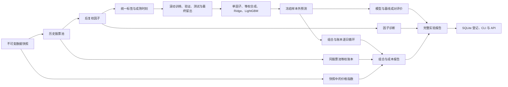

# 后端研究框架逻辑

2026-10-01。沿用 V2.0 的时间、价格、股票池、账本和复现契约；本轮实现研究与实验后端，前端按当前要求暂缓。
领域名词以 `CONTEXT.md` 为准。推荐配置为 `configs/research/daily_four_models_v1.yaml`。

## 从数据到实验



`observe research` 保留单独生成预测的入口；`observe run` 保留原来的离线账本回放入口；新增 `observe experiment` 将二者串成完整实验。
研究核心不导入 FastAPI。CLI、队列和 API 均调用同一组核心函数，查询接口只读落盘产物。

| 阶段 | 输入与规则 | 输出 / 入口 |
| --- | --- | --- |
| 数据 | 必须指定已存在的快照；只读标准分区；本轮不下载或重新发布数据 | `Store.state`、研究的 `data_manifest.json` |
| 股票池 | 历史在市证券，按决策日的上市、ST、停牌与流动性规则过滤；不提前按未来标签筛选 | `universe.parquet` |
| 因子 | 后复权价；时序窗口按交易日；横截面只用当天候选；方向先验固定 | 冻结的 `factor_set.yaml`、`factors.parquet` |
| 标签 | k+1 开盘进入、k+1+h 开盘退出；端点停牌不顺延；成熟时点记录到表 | `labels.parquet` |
| 切分 | 训练、验证、测试按决策日滚动；选参和重拟合分别按成熟时刻过滤；最终留出不足时阻断 | `split_plan.parquet` |
| 模型 | 每个决策日总训练权重相同；相关因子只在训练窗去重；所有候选结果保存 | 每窗模型 JSON、选参记录、`predictions.parquet` |
| 组合与账本 | 收盘决策，下一交易日开盘先卖后买；原始价、T+1、整手、费用和公司行动全部走现有唯一账本 | `variants/<id>/` 中的订单、成交、持仓、现金事件和净值 |
| 评价 | 标签只在开发区间内成熟；评价不训练、不成交；不可定义值保留缺失 | 三层 `report.json`、每日因子诊断与分组表 |

## 四个模型的选择与拟合

原有 `ModelConfig` 默认继续生成三个模型。显式配置非空的 `models.lgbm` 网格启用第四个模型；网格最多 12 组，不会因缺少依赖而静默跳过 LightGBM。

每个窗口依次执行：

1. 在训练窗做因子相关性去重，保留单因子基线所需的原始特征。
2. 用 `matured_at <= select_asof` 的训练样本拟合全部候选。Ridge 保持原 alpha / normalized 两种口径。
3. LightGBM 构建独立验证 Dataset，用 `matured_at <= fit_asof` 的验证样本按每日等权的 L2 早停；验证窗平均秩 IC 选择参数组合。L2 早停和秩 IC 选参是两个明确记录的步骤。
4. 每个模型族的验证秩 IC 全部不可定义时阻断，不能默认取第一个候选。
5. 在训练加验证的已成熟样本上重拟合。LightGBM 使用验证阶段冻结的迭代次数，重拟合不再早停；最终留出与测试窗标签均不参与此过程。
6. 在测试窗全部候选上预测，包括标签无效的证券。特征名与顺序不一致、非有限分数、重复预测或不匹配的测试窗都拒绝进入账本。

LightGBM 固定 CPU、随机种子、线程数、`deterministic=true` 和 `force_col_wise=true`。每窗保存原生 Booster 文本、特征顺序、版本、拟合样本数、选定迭代次数和增益重要性，不使用 pickle。
保存加载的预测在相同环境下逐位一致；不同平台的复现使用显式数值容差，并报告代码与依赖漂移，不能承诺不同二进制在任何数据上逐位相同。

## 三层评价

因子层保留原来的评价文件，并增加 `factor_daily.parquet`、`factor_groups.parquet` 与 `factor_diagnostics.json`：皮尔逊 IC、秩 IC、五组标签均值、多空标签差、分组换手、相邻决策日排名自相关、每日等权覆盖率、分年结果、因子相似度与块抽样区间。
分组名单先用当天有限因子值确定，并列值不随机拆开；标签缺失不替补、不补零。不同日期的排名自相关先在各自完整候选上排名，再对共同证券计算相关。分组收益是复权标签诊断，不连乘成净值。

模型层通过现有 `evaluation.paired` 比较 Ridge / LightGBM 与两个基线。预测主键、测试窗、模拟拟合时点、证据级别先通过成对门槛，再计算逐日秩 IC、前 N 名标签和逐窗差值。
按交易日位置做连续日期块抽样，块长为 `max(20, 4h)`，另报告两倍块长的敏感性区间；不可定义日保留原位置。区间描述固定预测条件下的抽样不确定性，不包含重新选参和拟合的变化。

组合层每个模型分别运行 `base`、`fees_x2`、`slippage_x2`，共 12 个账本运行。费率和滑点变化后重新生成逐日订单，复用同一份预测，不能把固定订单重放当作正式成本情景。
账本阻断的组合不展示正式绩效。基础滑点为 0 时，加倍仍为 0 的限制会记录；加倍后的滑点越界在配置阶段拒绝。

默认开启两个基准（`benchmarks.enabled: true`）：沪深 300 价格指数 `000300.SH`（不含分红），以及同股票池、同调仓节奏、同执行条件的完整候选等权组合。指数只从指定快照读取，不从当前发布状态或快照之外的文件补齐。
指数以前一交易日收盘作为期初；缺少某日收盘时，该日与下一交易日的指数日收益都不可定义，不前向填充或跨缺口计算。策略日收益仍完整保留。主动日收益为策略减基准；信息比率使用共同有效日的主动收益；年化收益率差在共同有效日分别复利年化后相减，年化系数仍为 242。

等权组合每个成本情景各运行一次，共三个额外账本子实验，产物位于 `benchmarks/`。它只使用冻结的 `universe.parquet` 与测试区间，不看模型分数、因子或未来标签是否缺失；调仓时重设全体候选的等权目标，沿用最大权重、参与度、现金规则、滑点、费用、T+1 与公司行动。
不使用 Top-N 的 `n`、`buffer`、`max_sell`。已有持仓超过目标时按决策收盘价生成整手部分减持，保留其余股份；非调仓日仅重发尚未完成的调仓意图。整手、现金与成交限制会使实际权重偏离目标。

新增 `benchmark_eval.json` 与 `benchmark_daily.parquet`，按模型、成本情景、基准分别保存主动指标、相对净值、共同日期与缺失日期。任一策略账本被阻断就不进入基准比较；等权账本被阻断时，其完整比较同样不可用，策略自身的可信指标仍保留。
当前真实快照缺 `index_1d`，因此指数接入已由合成快照验证，真实数据的指数主动指标保持不可用，并记入限制；真实同股票池等权基准已接通。

## 实验与预测复用

完整实验目录包含冻结配置、规则、一个研究子实验、模型与成本情景的账本子实验、三层报告、限制和内容哈希。
`subruns.json` 保存每个子实验的编号、路径、状态与 manifest 哈希；`data/runs/registry.sqlite` 保存实验状态、快照、代码提交、证据级别、父实验编号和路径。
旧实验通过 `observe runs index` 登记；网页服务启动时也读取旧状态建立登记。索引不改实验文件。

`observe variant` 只接受模型、组合、执行、初始资金与评价日期的设置；快照、因子、标签和切分继承父实验，禁止更换。
局部组合配置覆盖父实验对应字段，其余保持父配置；产物在父实验 `variants/` 下独占创建，已有文件不覆盖，也不会调用模型 fit。
除了父实验的预测复用，跨完整实验的阶段缓存已实现：股票池、逐个因子、分钟分区聚合、标签、切分、拟合与预测、详细评价和逐日账本。缓存放在 `data/cache/stages/<阶段>/<键>/`，每次实验保存独立的 `cache.json`；完整实验父目录记录详细评价缓存，研究与账本子目录记录各自阶段。

缓存键由快照身份、实际输入文件哈希、该阶段配置、上游产物内容、相关代码内容与 Python / 依赖版本组成；不以 Git 提交号变化代替相关代码变化。
修改单个公式、且不改变预热与候选边界时，只计算该因子；其他因子、标签与切分可复用。修改标签持有期重新生成标签及依赖阶段；修改成本复用研究和详细因子 / 模型评价，重算受影响的账本；同配置重复执行可复用账本。快照身份变化则全部重算。
每个键通过文件锁独占生成，临时目录完成后才发布；命中前逐文件校验哈希，损坏条目保留到 `data/cache/quarantine/` 后重算。复制产物到新实验，不使用硬链接，不覆盖已有产物。程序异常保留临时产物但不发布；账本阻断结果可作为诊断缓存，不能作为正式绩效。
读取输入和执行审计仍逐次运行，缓存不代替数据完整性检查；当前没有自动清理或缓存淘汰。

`observe reproduce` 强制绕过全部缓存，在新目录重跑研究、每个账本情景和基准，逐值比较股票池、因子、标签、切分、预测、因子每日明细、分组、评价、订单、账本与主动指标。复现前还核对冻结指数输入的文件哈希。
JSON 字典与列表中的浮点数递归使用 `abs_tol` / `rel_tol`；字符串、布尔值、键和列表结构保持严格比较。
旧 Windows 预测路径可按原实验编号在当前数据根目录或登记表定位，随后仍校验快照和冻结文件哈希，不下载替代数据。

## 使用命令

```bash
# 重建环境；Mac 缺少 libomp 时按环境规范用 Homebrew 安装
uv sync --extra ml --dev

# 完整实验，也可添加 --queue 提交后台任务
uv run --extra ml observe --root data experiment --config configs/research/daily_four_models_v1.yaml --snapshot 20260930-121952-b7e8

# 普通实验也可强制重算（YAML / 队列对应 cache: false）
uv run --extra ml observe --root data experiment --config configs/research/daily_four_models_v1.yaml --snapshot 20260930-121952-b7e8 --no-cache

# 仅重跑组合：YAML 中写 model、portfolio 或 execution
uv run --extra ml observe --root data variant <实验编号> --config <组合变体.yaml>

# 只读既有因子与标签，不重新训练
uv run --extra ml observe --root data factor eval --run <研究或完整实验编号>
uv run --extra ml observe --root data factor validate 'ts_mean(close_adj, 20)'

uv run --extra ml observe --root data runs list --kind experiment
uv run --extra ml observe --root data runs show <实验编号>
uv run --extra ml observe --root data compare <实验编号A> <实验编号B>
uv run --extra ml observe --root data reproduce <实验编号>
```

API 包括 `/api/factors`、`/api/factors/validate`、`/api/factors/{name}/evaluation?run=`、`/api/runs`、`/api/runs/compare?ids=a,b` 和实验详情。
`/api/runs/{id}/{table}` 对预测、因子、标签、订单、成交、持仓与净值使用 DuckDB 分页，支持日期、证券、模型和成本情景筛选。
`benchmark_daily` 另支持 `benchmark=000300.SH` 或 `benchmark=universe_equal`；查询等权基准账本用 `model=universe_equal&scenario=base`。实验详情直接返回缓存与基准评价报告。
新任务类型为 `experiment`、`backtest_variant`、`factor_eval`，配置在排队前校验，CLI 与任务返回同一套状态。

## 验证与边界

合成数据覆盖四模型预测、测试标签隔离、保存加载、完整离线复现、预测复用、成本情景、异常预测拒绝、因子手算、并列值、每日覆盖率、CLI / API / 队列和父实验文件保护。
原有三个模型与原配置保持兼容；原先迁移校验中的嵌套系数范数误报已修复。

执行 `uv run --frozen --extra ml pytest -q`，全量 277 项通过；最后补齐空成交 / 持仓表筛选和预测的模型筛选后，复测 `tests/integration/test_experiments.py`，10 项全部通过。
`ruff check src tests` 与 `git diff --check` 均通过。测试仅有现有 Starlette TestClient 对 httpx 的弃用提示，未额外安装新的 HTTP 客户端。

继续开发后的全量测试为 **288 项通过**。新增验证包括：指数缺口与期初缺失、完整候选等权及整手减持的独立手算、T+1 与参与度、并发缓存仅生成一次、损坏缓存隔离、失败不发布、改单因子 / 标签 / 快照 / 成本的失效范围、账本复用、基准 API 筛选、复现全部绕过缓存。原有回放黄金样本与复现契约均通过。

真实数据验证使用现有 `20260930-121952-b7e8` 快照、2024 年成交额较高的主板证券、预先固定的短窗口配置，验证四模型与 12 个账本情景的工程流程。
它使用较短训练窗和收窄股票池，不替代推荐配置的全区间研究，也不支持策略有效性结论。
当前日线从 2021 年开始，分钟线截至 2026-09-04；快照仍有 332 条日线审计警告，分钟缺退市证券，均继续保留在实验限制中。

本轮实际产物：

- 完整真实验证：`data/runs/20261001-210946-ed3583-experiment-15a8/`，四个测试窗、四模型、12 个账本情景，均为 `success_limited`（保留数据审计限制）。
- 完整真实验证复现：`data/runs/20261001-211036-ed3583-experiment-9c94/`，`comparison.json` 为 `match`，差异 0，包括因子每日明细 / 分组、预测和全部账本情景。
- 历史分钟研究复现：`data/runs/20261001-204931-2a8da7-repro-cfb5/`，源实验 `20260930-172026-59fb44-pair-extended-891b`，原先嵌套系数范数误报消除，差异 0。

本次基准与缓存的真实验证沿用上述预先固定的 2024 年工程配置，使用相同快照，没有下载或发布新数据：

- 首次运行：`20261001-230217-f274a8-experiment-d7a0`，13 个研究缓存条目首次生成，12 个模型 / 成本账本与 3 个等权基准账本均为 `success_limited`。
- 只改滑点至 0.0015：`20261001-230313-2258e2-experiment-2280`，13 个研究条目全部命中，15 个账本全部重算。
- 同配置再次运行：`20261001-230401-2258e2-experiment-ea79`，13 个研究条目和 15 个账本全部命中，详细评价也命中。
- 强制重算复现：`20261001-230446-2258e2-experiment-91f4`，`comparison.json` 为 `match`，差异 0，包括三个等权基准账本与全部逐日主动指标。
- 历史完整实验兼容复现：`20261001-231219-efd7e9-experiment-dbf9`，源实验 `20261001-210946-ed3583-experiment-15a8`，差异 0。旧配置未声明基准时沿用原设计，不在复现中擅自增加基准。
- 汇总记录：`data/validations/20261001-230217-f274a8-experiment-d7a0-benchmark-cache.json`。已发布状态哈希保持不变，历史完整实验 manifest 再次校验通过。真实快照没有价格指数，所以这些运行没有有效的指数主动指标；等权主动比较可用，仍受原数据审计限制。
